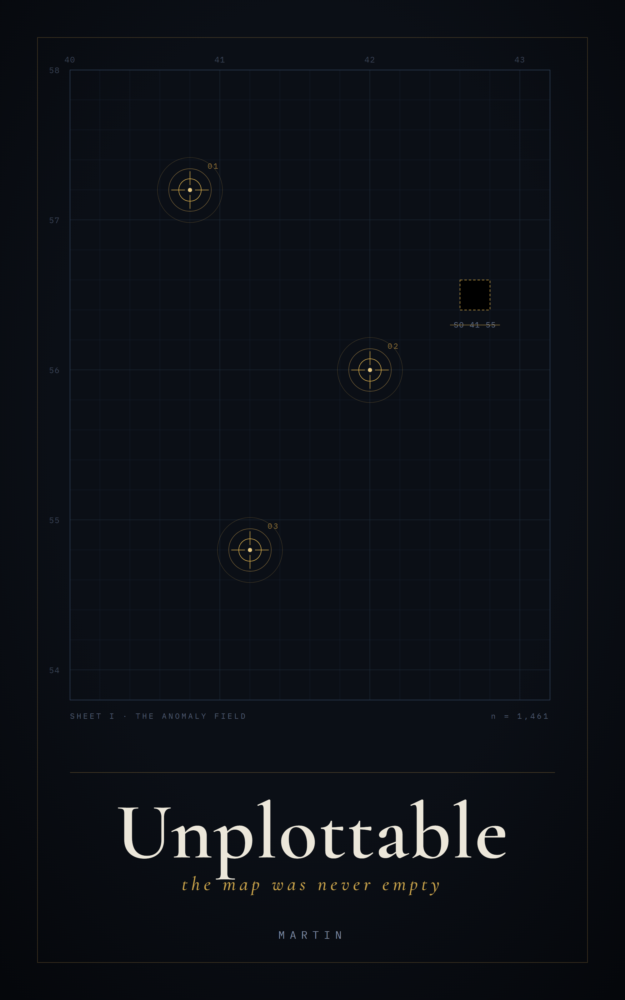
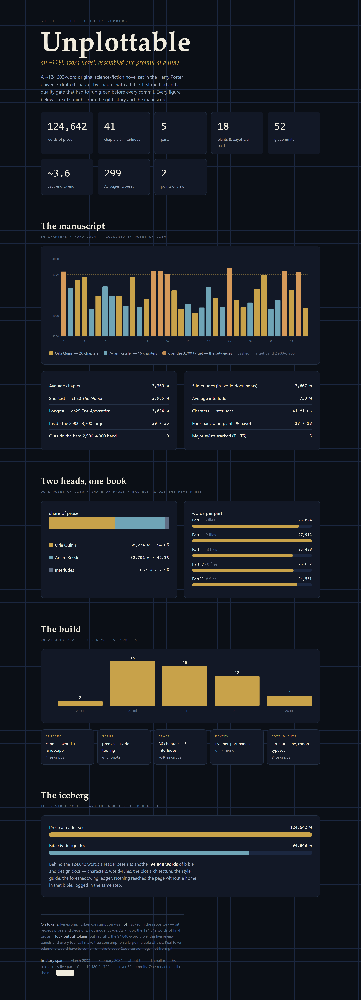

<div align="center">



# Unplottable

**an ~118k-word science-fiction novel, set in the Harry Potter universe, written one prompt at a time**

*working repo name: the-anomaly-engine*

`complete draft` · `EPUB · MOBI · A5 PDF` · `124,642 words` · `36 chapters + 5 interludes` · `private (a gift)`

</div>

---

## The book

> Britain, 2033. Adam Kessler, a Muggle machine-learning researcher, finds a fingerprint in the world's data that should not be there — structured, persistent, as if something has been patiently hiding from view. Orla Quinn, of the Ministry's Department of Mysteries, has one job: to make sure no one ever sees it. But a world that measures everything is a poor place to keep a secret, and the Statute of Secrecy that has held for three centuries is beginning to fail — not to a spell, but to statistics. The two people who understand it best stand on opposite sides of the same truth, and the only way out runs through each other.
>
> It is not a story about a war between magic and machines. It is a quiet thriller about secrecy — what it costs, who is owed the truth, and whether a secret can survive a world that can count even the things that are missing. The magic keeps its mystery; the near-future stays plausible; and every turn is meant to be *fair* — the kind you can walk back through afterwards and find, in plain sight the whole time, the sentence that was true when you first read it and truer once you knew.

## The book in numbers

<div align="center">



</div>

*Read straight from the git history and the manuscript. Interactive version: [`docs/stats.html`](docs/stats.html) · print/export: [`docs/unplottable-stats.pdf`](docs/unplottable-stats.pdf).*

| | | | |
|---|--:|---|--:|
| Prose | **124,642 w** | Point of view | 2 (close 3rd) |
| Chapters | 36 | — Orla Quinn | 54.8% |
| Interludes | 5 | — Adam Kessler | 42.3% |
| Parts | 5 | Plants & payoffs | 18 / 18 paid |
| Typeset length | 299 A5 pp | Major twists (T1–T5) | 5 |
| In target word-band | 29 / 36 | Outside hard band | 0 |
| Build span | ~3.6 days | Commits | 52 |
| Bible & design docs | 94,848 w | Written | 20–24 Jul 2026 |

## How it was made

The novel was written one prompt at a time by an **AI (Claude), directed by Martin Svoboda** — who conceived the project, set every constraint, made the decisions of scope and taste, and steered each step. Coherence across 118k words came not from holding the whole story in memory, but from **externalising its structure into checkable artefacts**:

- **A bible** ([`bible/`](bible/)) — the single source of truth for characters, world-rules, plot architecture, and voice. No fact reached the prose without a home in the bible, logged in the same step; the manuscript therefore could never contradict its own world.
- **A foreshadowing ledger** — 18 plants and payoffs tracked in a table and mirrored in every chapter's front-matter, so a setup in chapter 3 connects to its payoff in chapter 33 *by record, not by memory*.
- **A quality gate** ([`tools/gate.py`](tools/gate.py)) — an automated linter (word bands, banned phrases, canon capitalisation, ledger cross-check, timeline consistency) that had to pass green before every commit. The style guide is *literally its configuration*, so the rules and their enforcement can never drift apart.
- **A phase workflow** — Research → Setup (premise, architecture, tooling) → Draft, chapter by chapter → per-part Review panels (four independent lenses, used as a fair-play instrument) → Edit (structure cold-read, line edit, canon sweep) → Typeset.

Front-loading the architecture meant the writing became "fill in the cells," and the coherence came from the plan, the ledger, and the gate — not from working memory. Across the whole project the escalation rule (*redraft a weak chapter, never patch it in place*) never once had to fire: under-delivery was caught in-run by the gate, not as a re-run.

## Repository map

| Path | What it holds |
|---|---|
| [`bible/`](bible/) | The world's single source of truth — characters, world-rules, plot architecture, style guide, foreshadowing ledger |
| [`manuscript/`](manuscript/) | 36 chapters + 5 interludes (`part-N/chNN-slug.md`), each with YAML front-matter |
| [`book/`](book/) | Front/back matter, metadata, and the cover (`cover.png` + reproducible `cover.html` source) |
| [`tools/`](tools/) | `gate.py` (quality gate) · `build.ps1` (EPUB / MOBI / A5 PDF) |
| [`docs/`](docs/) | Decisions ([`adr.md`](docs/adr.md)), the writing workflow, and the stats dashboard |
| [`dev_history.md`](dev_history.md) | The full changelog — every prompt, decision, and model-fit note |

## Build

```bash
python tools\gate.py         # quality gate — must be green before any commit
python tools\gate.py --selftest   # prove all 19 checks still fire
powershell tools\build.ps1   # assemble → EPUB + MOBI + A5 PDF (with cover)
```

The build wraps the manuscript in the `book/` front/back matter, embeds the cover, and typesets the A5 PDF with a self-contained LaTeX engine (tectonic). Output lands in `build/` (gitignored).

## Authorship & AI disclosure

The **prose is AI-generated**: written by Claude (Anthropic) under the human direction of **Martin Svoboda**, who conceived and commissioned the work, defined its constraints and quality bar, and made every decision of scope and taste. In short: **human-directed, AI-written.** Per-prompt token consumption was not tracked in this repository — git records prose and decisions, not model usage.

## Disclaimer

Unofficial fan fiction based on the *Harry Potter* series created by J. K. Rowling. No affiliation with, or endorsement by, the rights holders (J. K. Rowling, Warner Bros., Bloomsbury, Scholastic). **Non-commercial; no money is or will be made from this work.** All original characters and premise © this project's author; the Wizarding World remains the property of its owners.
